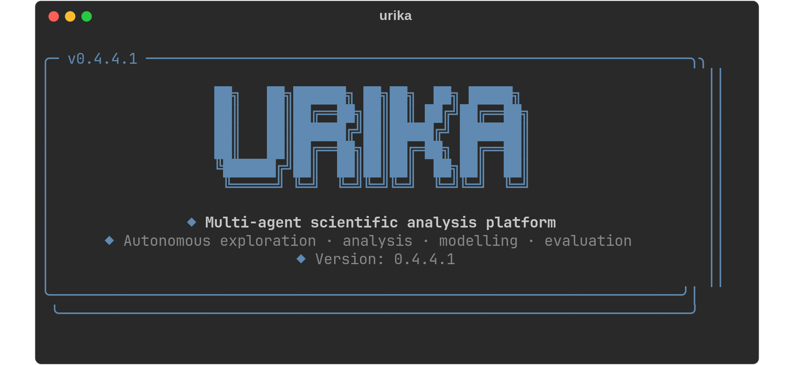
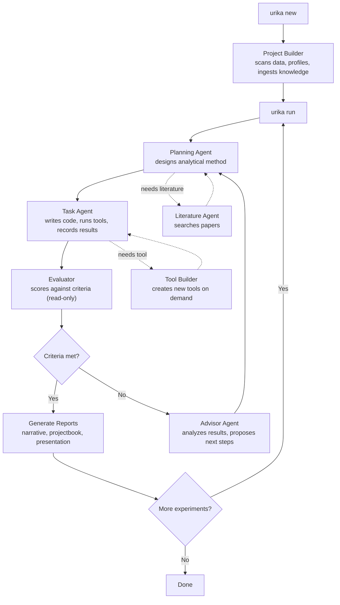

<p align="center">
  
</p>

<p align="center">
  <a href="docs/01-getting-started.md">Getting Started</a> &middot;
  <a href="docs/12-cli-reference.md">CLI Reference</a> &middot;
  <a href="docs/13-interactive-repl.md">Interactive REPL</a> &middot;
  <a href="docs/06-agent-system.md">Agent System</a>
</p>

---

Urika uses multiple AI agents to autonomously explore analytical approaches for your dataset and research question. It creates experiments, tries different methods, evaluates results, and documents everything in a structured projectbook.

Currently supports the **Claude Agent SDK** (Anthropic), including local models via Ollama. Adapters for **OpenAI Agents SDK**, **Google Agent Development Kit (ADK)**, and **Pi** are planned for upcoming releases.

## Installation

```bash
pip install -e ".[agents]"
```

Requires Python >= 3.11 and Claude access via API key (`ANTHROPIC_API_KEY`) or Claude Max/Pro account.

See [Getting Started](docs/01-getting-started.md) for full installation options.

## Quickstart

```bash
# Create a project
urika new my-study \
  --question "What predicts the outcome?" \
  --data ./my_data.csv

# Run an experiment
urika run my-study

# View results
urika results my-study
urika report my-study

# Or use the interactive REPL
urika
```

## How It Works



Ten agents work together in an orchestrated loop. The **Orchestrator** cycles through `planning -> task -> evaluator -> advisor` each turn. A **Meta-Orchestrator** manages experiment-to-experiment transitions.

See [Agent System](docs/06-agent-system.md) for details on each agent role.

## Privacy and Model Configuration

Each project can configure which models and endpoints its agents use. Three privacy modes:

- **Open** (default) -- all agents use cloud models via API. No restrictions.
- **Private** -- all agents use private endpoints only. This can be local models (Ollama), a secure institutional server, or any combination -- whatever stays within your data governance boundary.
- **Hybrid** -- a private Data Agent reads raw data and outputs sanitized summaries; all other agents run on cloud models for maximum analytical power. Raw data never leaves your private environment. The default hybrid split covers most cases, but you can customize which agents use which endpoints to ensure what needs to be private stays private.

Per-agent model routing lets you optimize for cost (Haiku for simple tasks, Opus for complex reasoning) or compliance (institutional servers for data access, cloud for method design). Different projects can have completely different privacy and model settings.

See above for supported and upcoming SDK adapters.

See [Models and Privacy](docs/07-models-and-privacy.md) for configuration details.

## Documentation

| Guide | Description |
|-------|-------------|
| [Getting Started](docs/01-getting-started.md) | Installation, requirements, first project |
| [Core Concepts](docs/02-core-concepts.md) | Projects, experiments, runs, methods, tools, agents |
| [Creating Projects](docs/03-creating-projects.md) | `urika new`, data scanning, knowledge ingestion |
| [Running Experiments](docs/04-running-experiments.md) | Orchestrator loop, turns, auto mode, resume |
| [Viewing Results](docs/05-viewing-results.md) | Reports, presentations, methods, leaderboard |
| [Agent System](docs/06-agent-system.md) | All 10 agent roles and how they interact |
| [Models and Privacy](docs/07-models-and-privacy.md) | Per-agent model routing, endpoints, hybrid privacy mode |
| [Built-in Tools](docs/08-built-in-tools.md) | 16 analysis tools agents use |
| [Knowledge Pipeline](docs/09-knowledge-pipeline.md) | Ingesting papers, PDFs, searching |
| [Configuration](docs/10-configuration.md) | urika.toml, criteria, preferences |
| [Project Structure](docs/11-project-structure.md) | File layout and what each file does |
| [CLI Reference](docs/12-cli-reference.md) | Every command with full options |
| [Interactive REPL](docs/13-interactive-repl.md) | Slash commands, tab completion, conversation mode |

## License

[Apache 2.0](LICENSE) -- Free to use, modify, and distribute for any purpose, including commercial use. Includes patent protection for contributors. See the [full license](LICENSE) for details.
