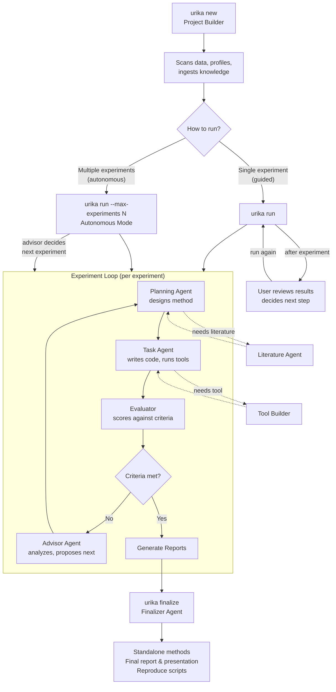

<p align="center">
  
</p>

<p align="center">
  <a href="docs/01-getting-started.md">Getting Started</a> &middot;
  <a href="docs/14-cli-reference.md">CLI Reference</a> &middot;
  <a href="docs/15-interactive-repl.md">Interactive REPL</a> &middot;
  <a href="docs/08-agent-system.md">Agent System</a>
</p>

---

> **Early Development** — Urika is under active development. Expect frequent updates, bug fixes, and new features. Check back regularly or run `urika setup` to see if a new version is available. Bug reports and feedback welcome at [GitHub Issues](https://github.com/xkiwilabs/Urika/issues).

Urika uses multiple AI agents to autonomously explore analytical approaches for your dataset and research question. It creates experiments, tries different methods, evaluates results, and documents everything in a structured projectbook.

Currently supports the **Claude Agent SDK** (Anthropic), including local models via Ollama. Adapters for **OpenAI Agents SDK**, **Google Agent Development Kit (ADK)**, and **PI** are planned for upcoming releases.

## Installation

### Prerequisites

1. Python >= 3.11
2. Claude Pro or Max account (recommended) — or an Anthropic API key
3. Claude Code CLI — install and log in first:

```bash
npm install -g @anthropic-ai/claude-code
claude login                    # opens browser to authenticate
```

### Install Urika

```bash
git clone https://github.com/xkiwilabs/Urika.git
cd Urika
pip install -e .                # includes visualization, ML, and knowledge pipeline
urika setup                     # check installation, detect hardware, optionally install DL
```

The default install includes everything except deep learning (torch, transformers, etc.). For deep learning: `pip install -e ".[dl]"`.

See [Getting Started](docs/01-getting-started.md) for full details.

## Quickstart

```bash
urika new my-study --data ./my_data.csv    # create a project (interactive)
urika run my-study                          # run experiments
urika finalize my-study                     # produce final report
urika                                       # or use the interactive REPL
```

See the [Getting Started](docs/01-getting-started.md) guide for a full walkthrough.

## How It Works



Eleven agents work together. Each experiment runs autonomously — agents plan, execute, evaluate, and iterate without intervention. You choose how to manage the *between-experiment* flow:

- **Guided** (`urika run`) — agents run one experiment autonomously, then you review results and decide what to try next. Best for exploratory work and complex domains where human judgment matters between experiments.
- **Fully autonomous** (`urika run --max-experiments N`) — the system runs multiple experiments back-to-back, with the advisor agent deciding what to try next. Best when you've provided detailed context (see [Prompts and Context](docs/04-prompts-and-context.md)).

Within each experiment, the orchestrator cycles through `planning -> task -> evaluator -> advisor` each turn. When all experiments are complete, the **Finalizer** produces standalone deliverables.

See [Agent System](docs/08-agent-system.md) for details on each agent role.

## Privacy and Model Configuration

Each project can configure which models and endpoints its agents use. Three privacy modes:

- **Open** (default) -- all agents use cloud models via API. No restrictions.
- **Private** -- all agents use private endpoints only. This can be local models (Ollama), a secure institutional server, or any combination -- whatever stays within your data governance boundary.
- **Hybrid** -- a private Data Agent reads raw data and outputs sanitized summaries; all other agents run on cloud models for maximum analytical power. Raw data never leaves your private environment. The default hybrid split covers most cases, but you can customize which agents use which endpoints to ensure what needs to be private stays private.

Per-agent model routing lets you optimize for cost (Haiku for simple tasks, Opus for complex reasoning) or compliance (institutional servers for data access, cloud for method design). Different projects can have completely different privacy and model settings.

See above for supported and upcoming SDK adapters.

See [Models and Privacy](docs/11-models-and-privacy.md) for configuration details.

## Documentation

| Guide | Description |
|-------|-------------|
| [Getting Started](docs/01-getting-started.md) | Installation, requirements, first project |
| [Core Concepts](docs/02-core-concepts.md) | Projects, experiments, runs, methods, tools, agents |
| [Creating Projects](docs/03-creating-projects.md) | `urika new`, data scanning, knowledge ingestion |
| [Prompts and Context](docs/04-prompts-and-context.md) | Writing effective descriptions, instructions, knowledge ingestion |
| [Running Experiments](docs/05-running-experiments.md) | Orchestrator loop, turns, auto mode, resume |
| [Viewing Results](docs/06-viewing-results.md) | Reports, presentations, methods, leaderboard |
| [Finalizing Projects](docs/07-finalizing-projects.md) | Finalization sequence, standalone methods, reproducibility |
| [Agent System](docs/08-agent-system.md) | All 11 agent roles and how they interact |
| [Built-in Tools](docs/09-built-in-tools.md) | 18 analysis tools agents use |
| [Knowledge Pipeline](docs/10-knowledge-pipeline.md) | Ingesting papers, PDFs, searching |
| [Models and Privacy](docs/11-models-and-privacy.md) | Per-agent model routing, endpoints, hybrid privacy mode |
| [Configuration](docs/12-configuration.md) | urika.toml, criteria, preferences |
| [Project Structure](docs/13-project-structure.md) | File layout and what each file does |
| [CLI Reference](docs/14-cli-reference.md) | Every command with full options |
| [Interactive REPL](docs/15-interactive-repl.md) | Slash commands, tab completion, conversation mode |

## License

[Apache 2.0](LICENSE) -- Free to use, modify, and distribute for any purpose, including commercial use. Includes patent protection for contributors. See the [full license](LICENSE) for details.
