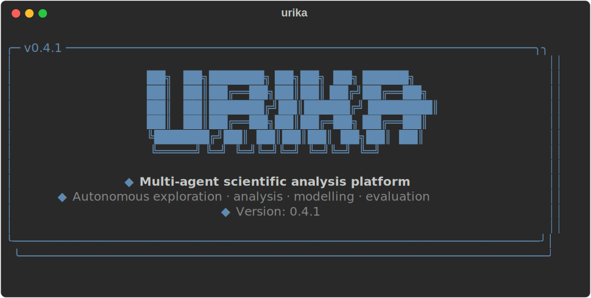
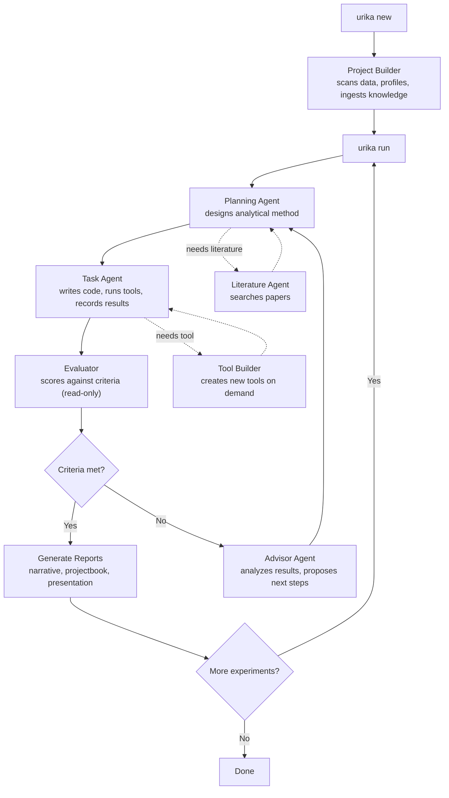

<p align="center">
  
</p>

<p align="center">
  <strong>Multi-agent scientific analysis platform for behavioral and health sciences.</strong>
</p>

<p align="center">
  <a href="docs/01-getting-started.md">Getting Started</a> &middot;
  <a href="docs/06-cli-reference.md">CLI Reference</a> &middot;
  <a href="docs/07-interactive-repl.md">Interactive REPL</a> &middot;
  <a href="docs/08-agent-system.md">Agent System</a>
</p>

---

Urika uses multiple AI agents (powered by Claude) to autonomously explore analytical approaches for your dataset and research question. It creates experiments, tries different methods, evaluates results, and documents everything in a structured projectbook.

## Installation

```bash
pip install -e ".[agents]"
```

Requires Python >= 3.11 and a Claude API key (`ANTHROPIC_API_KEY` environment variable).

See [Getting Started](docs/01-getting-started.md) for full installation options.

## Quickstart

```bash
# Create a project
urika new my-study \
  --question "What predicts the outcome?" \
  --data ./my_data.csv

# Run an experiment
urika run my-study

# View results
urika results my-study
urika report my-study

# Or use the interactive REPL
urika
```

## How It Works



Nine agents work together in an orchestrated loop. The **Orchestrator** cycles through `planning -> task -> evaluator -> advisor` each turn. A **Meta-Orchestrator** manages experiment-to-experiment transitions.

See [Agent System](docs/08-agent-system.md) for details on each agent role.

## Documentation

| Guide | Description |
|-------|-------------|
| [Getting Started](docs/01-getting-started.md) | Installation, requirements, first project |
| [Core Concepts](docs/02-core-concepts.md) | Projects, experiments, runs, methods, tools, agents |
| [Creating Projects](docs/03-creating-projects.md) | `urika new`, data scanning, knowledge ingestion |
| [Running Experiments](docs/04-running-experiments.md) | Orchestrator loop, turns, auto mode, resume |
| [Viewing Results](docs/05-viewing-results.md) | Reports, presentations, methods, leaderboard |
| [CLI Reference](docs/06-cli-reference.md) | Every command with full options |
| [Interactive REPL](docs/07-interactive-repl.md) | Slash commands, tab completion, conversation mode |
| [Agent System](docs/08-agent-system.md) | All 9 agent roles and how they interact |
| [Built-in Tools](docs/09-built-in-tools.md) | 16 analysis tools agents use |
| [Knowledge Pipeline](docs/10-knowledge-pipeline.md) | Ingesting papers, PDFs, searching |
| [Configuration](docs/11-configuration.md) | urika.toml, criteria, preferences |
| [Project Structure](docs/12-project-structure.md) | File layout and what each file does |

## Development

```bash
pip install -e ".[dev]"
pytest -v              # 869 tests
ruff check src/ tests/ # Lint
```

## License

[MIT](LICENSE)
