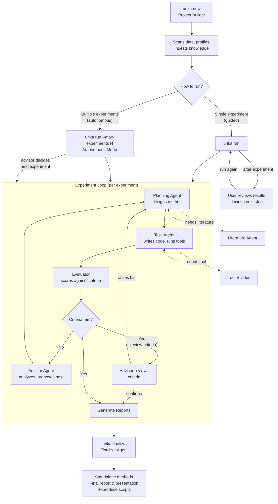

<p align="center">
  
</p>

<p align="center">
  <a href="docs/01-getting-started.md">Getting Started</a> &middot;
  <a href="docs/11-agent-system.md">Agent System</a> &middot;
  <a href="docs/13a-models-and-privacy.md">Models &amp; Privacy</a> &middot;
  <a href="docs/19a-notifications-channels.md">Notifications</a> &middot;
  <a href="docs/16a-cli-projects.md">CLI Reference</a> &middot;
  <a href="docs/17-interactive-tui.md">Interactive TUI</a> &middot;
  <a href="docs/18a-dashboard-pages.md">Dashboard</a>
</p>

---

> **Early Development** — Urika is under active development. Expect frequent updates, bug fixes, and new features. Check back regularly or run `urika setup` to see if a new version is available. Bug reports and feedback welcome at [GitHub Issues](https://github.com/xkiwilabs/Urika/issues).

Urika uses multiple AI agents to autonomously explore analytical approaches for your dataset and research question. It creates experiments, tries different methods, evaluates results, searches relevant literature, and builds custom tools when needed. Everything is documented automatically — experiment labbooks, project-level reports, key findings, and slide presentations you can view in any browser. Each experiment's methods, metrics, and observations are tracked in structured records that agents use to plan the next step.

Currently supports the **Claude Agent SDK** (Anthropic), including local models via Ollama. Adapters for **OpenAI Agents SDK**, **Google Agent Development Kit (ADK)**, and **PI** are planned for upcoming releases.

**Runs on Linux, macOS, and Windows 11.** For local/private model setups (Ollama, vLLM, LiteLLM), see [Models & Privacy](docs/13a-models-and-privacy.md).

## Three interfaces

Urika has three first-class interfaces — CLI, TUI, and dashboard. They share the same project state on disk, so anything you do in one shows up in the others.

| Interface | Command | When to use |
|-----------|---------|-------------|
| **CLI** | `urika <command>` | Scripting, batch jobs, CI, remote sessions, `--json` output for tooling |
| **TUI** | `urika` | Exploratory orchestrator chat, watching a run with rich activity feedback, slash commands with tab completion |
| **Dashboard** | `urika dashboard [project]` | Monitoring long runs, sharing results in a browser, settings forms, sessions tab |

See [Interfaces Overview](docs/02-interfaces-overview.md) for a full task-by-task cheat sheet across all three.

## Installation

### Prerequisites

1. **Python 3.11+** (required) — see [Getting Started → Step 1](docs/01-getting-started.md#python-311-required) for per-OS install commands.
2. **Anthropic API key** (required) — set up in step 3 below. Per Anthropic's Consumer Terms §3.7 and the April 2026 Agent SDK clarification, a Claude Pro/Max subscription cannot be used to authenticate the Claude Agent SDK that Urika depends on. v0.3 ships with the Anthropic adapter only; adapters for OpenAI, Google ADK, and PI are planned for upcoming releases.
3. **Claude Code CLI on PATH** *(recommended, not required)* — `npm install -g @anthropic-ai/claude-code`. The Claude Agent SDK ships its own bundled `claude` binary, so you can skip this and Urika will fall back to the bundled one. Install your own to use `claude-opus-4-7` or any future Anthropic model — the bundled binary lags. See [Getting Started → Claude Code CLI](docs/01-getting-started.md#claude-code-cli-recommended) for the why.

### Install Urika

**Recommended: install from source** in a Python virtual environment. Urika is under active development with frequent updates.

On Ubuntu 22.04+, Debian 12+, Fedora 38+, and recent macOS, system Python refuses `pip install` with `error: externally-managed-environment` (PEP 668), so a venv is the simplest path:

```bash
python3 -m venv ~/.venvs/urika
source ~/.venvs/urika/bin/activate    # Windows PowerShell: ~\.venvs\urika\Scripts\Activate.ps1

git clone https://github.com/xkiwilabs/Urika.git
cd Urika
pip install -e ".[dev]"
urika setup                     # check installation, detect hardware, optionally install DL
```

To update: `cd Urika && git pull`.

**Alternative: install from PyPI** (pre-release — may lag behind source):

```bash
pip install urika
```

`pipx`, `conda`, and `uv` work too. Deep learning (`torch`, `transformers`) is optional: `pip install "urika[dl]"`.

### Set up API key

1. Get a key at [console.anthropic.com](https://console.anthropic.com) → Settings → API Keys.
2. Set a monthly spend limit in Settings → Billing.
3. Save the key (Urika is now installed, so the CLI is available):

   ```bash
   urika config api-key             # interactive — saves to ~/.urika/secrets.env
   urika config api-key --test      # verify the key works against api.anthropic.com
   # or: export ANTHROPIC_API_KEY=sk-ant-...
   ```

See [Getting Started](docs/01-getting-started.md) for the full walkthrough including verification, troubleshooting, and per-OS notes. See [Provider compliance](docs/20-security.md#provider-compliance) for the full Anthropic policy rationale.

## Quickstart

```bash
urika new my-study --data ./my_data.csv    # create a project (interactive)
urika run my-study --dry-run                # preview the planned pipeline first
urika run my-study                          # run experiments
urika finalize my-study                     # produce final report
urika                                       # launch the interactive TUI
urika --classic                             # or use the classic REPL
```

See the [Getting Started](docs/01-getting-started.md) guide for a full walkthrough. **Agent-generated code runs as you** — see [Security Model](docs/20-security.md) before running unfamiliar projects.

## How It Works



Twelve agents work together. Each experiment runs autonomously — agents plan, execute, evaluate, and iterate without intervention. You choose how to manage the *between-experiment* flow:

- **Guided** (`urika run`) — agents run one experiment autonomously, then you review results and decide what to try next. Best for exploratory work and complex domains where human judgment matters between experiments.
- **Fully autonomous** (`urika run --max-experiments N`) — the system runs multiple experiments back-to-back, with the advisor agent deciding what to try next. Best when you've provided detailed context (see [Prompts and Context](docs/05-prompts-and-context.md)).

Within each experiment, the orchestrator cycles through `planning -> task -> evaluator -> advisor` each turn. When all experiments are complete, the **Finalizer** produces standalone deliverables.

See [Agent System](docs/11-agent-system.md) for details on each agent role.

## Scriptable CLI

Every Urika command is fully scriptable -- pass arguments and flags directly, get structured JSON output with `--json`, and chain commands in shell scripts. No interactive prompts when flags are provided.

```bash
# Create and run a project in one script
urika new my-study --data ~/data/scores.csv --question "What predicts outcome?" --mode exploratory
urika run my-study --max-turns 5 --instructions "focus on tree-based models"
urika run my-study --max-experiments 3 --auto
urika finalize my-study --instructions "emphasize the best model"

# Get structured output for custom tooling
urika status my-study --json
urika results my-study --json
urika methods my-study --json

# Remote control via Telegram/Slack while experiments run
# See Notifications docs for setup
```

This makes it straightforward to build custom workflows, batch processing scripts, CI pipelines, or wrap Urika in your own research tools. See [CLI Reference](docs/16a-cli-projects.md) for the full command list.

## Privacy and Model Configuration

Each project can configure which models and endpoints its agents use. Three privacy modes:

- **Open** (default) -- all agents use cloud models via API. No restrictions.
- **Private** -- all agents use private endpoints only. This can be local models (Ollama), a secure institutional server, or any combination -- whatever stays within your data governance boundary.
- **Hybrid** -- a private Data Agent reads raw data and outputs sanitized summaries; all other agents run on cloud models for maximum analytical power. Raw data never leaves your private environment. The default hybrid split covers most cases, but you can customize which agents use which endpoints to ensure what needs to be private stays private.

Per-agent model routing lets you optimize for cost (Haiku for simple tasks, Opus for complex reasoning) or compliance (institutional servers for data access, cloud for method design). Different projects can have completely different privacy and model settings.

See above for supported and upcoming SDK adapters.

See [Models and Privacy](docs/13a-models-and-privacy.md) for configuration details.

## Documentation

| Guide | Description |
|-------|-------------|
| [Getting Started](docs/01-getting-started.md) | Installation, requirements, first project |
| [Interfaces Overview](docs/02-interfaces-overview.md) | CLI, TUI, and dashboard as three peer interfaces — when to use which |
| [Core Concepts](docs/03-core-concepts.md) | Projects, experiments, runs, methods, tools, agents |
| [Creating Projects](docs/04-creating-projects.md) | `urika new`, data scanning, knowledge ingestion |
| [Prompts and Context](docs/05-prompts-and-context.md) | Writing effective descriptions, instructions, knowledge ingestion |
| [Running Experiments](docs/06-running-experiments.md) | Orchestrator loop, turns, auto mode, resume |
| [Advisor Chat and Instructions](docs/07-advisor-and-instructions.md) | Standalone advisor conversations, steering agents, suggestion-to-run flow |
| [Viewing Results](docs/08-viewing-results.md) | Reports, presentations, methods, leaderboard |
| [Finalizing Projects](docs/09-finalizing-projects.md) | Finalization sequence, standalone methods, reproducibility |
| [Knowledge Pipeline](docs/10-knowledge-pipeline.md) | Ingesting papers, PDFs, searching |
| [Agent System](docs/11-agent-system.md) | All 12 agent roles and how they interact |
| [Tools Overview](docs/12a-tools-overview.md) | Philosophy, ITool / ToolResult API, registry, project-specific tools |
| [Tools Catalogue](docs/12b-tools-catalogue.md) | Per-category reference for all 24 built-in tools |
| [Models and Privacy](docs/13a-models-and-privacy.md) | Privacy modes, hybrid architecture, per-agent endpoint assignment |
| [Local Models](docs/13b-local-models.md) | Ollama, LM Studio, vLLM/LiteLLM proxy setup, tested-models table |
| [Project Configuration](docs/14a-project-config.md) | Per-project urika.toml, criteria, methods, usage |
| [Global Configuration](docs/14b-global-config.md) | `~/.urika/settings.toml`, secrets vault, environment variables |
| [Project Structure](docs/15-project-structure.md) | File layout and what each file does |
| [CLI Reference — Projects](docs/16a-cli-projects.md) | `urika new`, `list`, `delete`, `status`, `inspect`, `update` |
| [CLI Reference — Experiments](docs/16b-cli-experiments.md) | `urika experiment` group and `urika run` |
| [CLI Reference — Results and Reports](docs/16c-cli-results.md) | `dashboard`, `results`, `methods`, `logs`, `report`, `present`, `criteria`, `usage` |
| [CLI Reference — Agents](docs/16d-cli-agents.md) | `advisor`, `evaluate`, `plan`, `finalize`, `build-tool`, `summarize` |
| [CLI Reference — System](docs/16e-cli-system.md) | `knowledge`, `venv`, `config`, `notifications`, `setup`, `tools`, env vars |
| [Interactive TUI](docs/17-interactive-tui.md) | TUI interface, slash commands, tab completion, orchestrator chat |
| [Dashboard — Pages](docs/18a-dashboard-pages.md) | Pages, modals, live log, advisor chat, sessions, sidebar, theme |
| [Dashboard — Operations](docs/18b-dashboard-operations.md) | Lockfiles, idempotent spawn endpoints, completion CTAs, project deletion |
| [Dashboard — Settings](docs/18c-dashboard-settings.md) | Project + global settings, notification test-send, `--auth-token` |
| [Dashboard — API](docs/18d-dashboard-api.md) | Cross-surface coordination, HTMX/fetch endpoint reference, tech stack |
| [Notifications — Channels](docs/19a-notifications-channels.md) | Email, Slack, Telegram setup walkthroughs |
| [Notifications — Remote](docs/19b-notifications-remote.md) | Remote `/commands`, what gets notified, troubleshooting, caveats |
| [Security Model](docs/20-security.md) | Agent-generated code, permission boundaries, secrets, dashboard auth |

## Coming soon

Roadmap to **v1.0.0**. Order is firm; bug-fix point releases (`v0.x.y`)
are interleaved between feature releases as issues surface.

**v0.5 — project memory deepening**
- Curator agent that auto-organises captured memory entries, merges near-duplicates, flags contradictions
- `urika memory archive` CLI + dashboard "show archived" toggle for browsing superseded entries
- `urika memory diff <from> <to>` + dashboard timeline view of memory growth
- Planner / advisor read-rule refinement so curator-grown memory stays under the prompt token budget

**v0.6 — second LLM backend + project templates**
- OpenAI Agents SDK adapter (validates the `urika.runners` entry-point seam shipped in v0.4)
- `urika new --template behavioral|timeseries|imaging|nlp|ml-baseline` with seeded criteria, recommended tools, sample knowledge entries

**v0.7 — GitHub auto-backup**
- `urika github init <project> --remote <url>` — wraps `git init` + `git remote add`
- `urika github init <project> --create [--public]` — uses `gh` CLI to create the repo + push in one shot (Urika never holds GitHub credentials)
- Auto-create at project-creation time via `urika new --github` or a global `[preferences] github_auto_create` default
- `urika github push|status|pull <project>` for manual control
- Opt-in auto-push hook that fires after `urika run` / `finalize` / `build-tool`
- Dashboard Git tab — remote URL, last push, recent commit log, manual "Push now"

**v0.8 — publication-ready output polish**
- PDF / LaTeX export via `urika report --format pdf|latex` and `urika finalize --format pdf|latex` (Pandoc-based)
- Jupyter notebook export — `urika finalize --jupyter` produces a runnable `reproduce.ipynb` alongside `reproduce.sh`
- Auto-generated model cards per finalized method (Hugging Face template)

**v0.9 — accessibility + i18n stubs**
- Keyboard navigation, focus states, ARIA labels, light/dark colour-contrast audit on the dashboard
- User-facing strings extracted into `urika/i18n/en.toml` so future translations are mechanical (no actual translations shipped)

**v1.0 — first stable release**
- Semantic-versioning commitment: v1.x = no breaking changes to documented public API; ≥ 6 months deprecation telegraph for v2
- Project file format stable across v1.x (`urika.toml`, `criteria.json`, `methods.json`, `progress.json`, `findings.json`, `memory/MEMORY.md`); auto-migrate via `urika upgrade`
- CLI command surface + dashboard URL surface stable
- Full test coverage on Linux + macOS + Windows on Python 3.11 / 3.12
- Comprehensive documentation for every command, agent role, and config key
- Documented security model and permission boundaries

**Cut from v1.0** (parked for v1.1+):
- Plugin system (API commitment problem — needs a year of real-world adapter usage first)
- Mobile-responsive dashboard (the phone use case is already covered by Slack/Telegram notifications)
- GitHub thick integration (OAuth, audit log, in-app PR flows — beyond pure git shell-out)
- arXiv fetcher, Plotly figures, Optuna agent (great-to-haves, not blockers for 1.0)

In between feature releases, bug-fix hotfixes (`v0.x.y`) ship as
issues are reported. v0.4.1 (this release) closed the v0.4.x bug
backlog. See [CHANGELOG.md](CHANGELOG.md) for the full history.

## Citation

If you use Urika in your research or analysis, please acknowledge its use in your publications:

> Urika -- Multi-agent scientific analysis platform. Developed by Michael J. Richardson and colleagues at Macquarie University, Sydney, Australia. https://github.com/xkiwilabs/Urika

## License

[Apache 2.0](LICENSE) -- Free to use, modify, and distribute for any purpose, including commercial use. Includes patent protection for contributors. See the [full license](LICENSE) for details.
