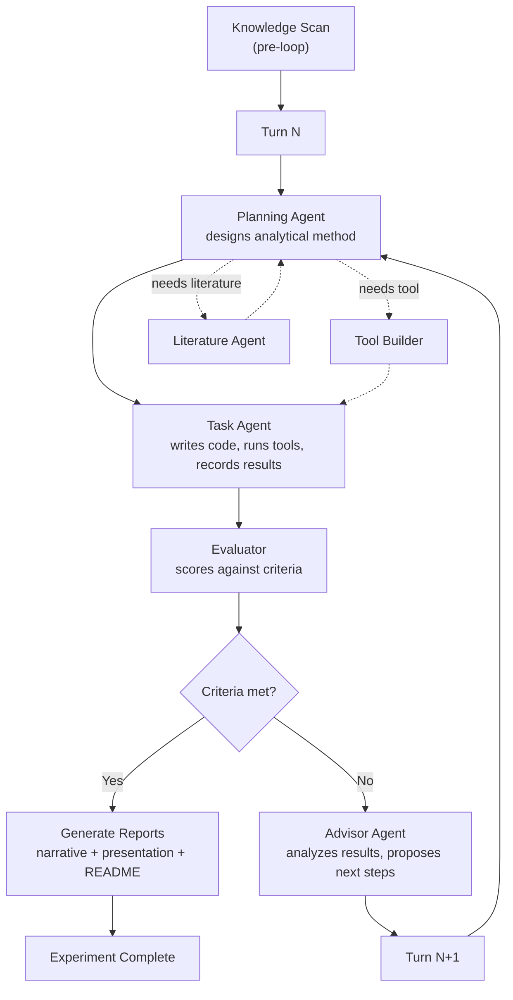

# Running Experiments

This document covers the `urika run` command, how the orchestrator loop works in detail, turn limits, auto mode, and what happens when experiments complete.

## The `urika run` command

```
urika run [PROJECT] [OPTIONS]
```

### Arguments

| Argument | Required | Description |
|----------|----------|-------------|
| `PROJECT` | No | Project name. If omitted and only one project exists, it is used automatically. If multiple projects exist, you are prompted to select one. |

### Options

| Option | Description |
|--------|-------------|
| `--experiment ID` | Run a specific experiment by its ID (e.g., `exp-001-baseline`). If omitted, Urika auto-selects (see below). |
| `--max-turns N` | Maximum number of orchestrator turns. Overrides the project's `urika.toml` setting. |
| `--continue` | Resume a paused or failed experiment from where it left off. |
| `--auto` | Fully autonomous mode -- no confirmation prompts between experiment selection and execution. |
| `--instructions TEXT` | Guide the next experiment with free-text instructions (e.g., `"focus on tree-based models"`). |
| `-q, --quiet` | Suppress verbose tool-use streaming output. The orchestrator still runs; you just see less intermediate detail. |

### Examples

When you run without flags, Urika shows a settings dialog:

```bash
urika run my-study
```

```
Run settings for my-study:
  Max turns: 5

Proceed?
  1. Run with defaults (default)
  2. Run multiple experiments (meta-orchestrator)
  3. Custom max turns
  4. Skip
```

Option 2 asks how many experiments and launches the meta-orchestrator, which runs multiple experiments in sequence. Option 3 lets you override the turn limit for this run.

If you provide any flag, the dialog is skipped and Urika runs directly:

Run a specific experiment with a custom turn limit:

```bash
urika run my-study --experiment exp-002-ensemble --max-turns 10
```

Resume a paused experiment:

```bash
urika run my-study --continue
```

Fully autonomous with guidance:

```bash
urika run my-study --auto --instructions "try neural network approaches"
```

## How experiments are selected

When you run `urika run` without specifying an experiment, the orchestrator follows this logic:

1. **Pending experiments** -- if any experiments exist that have not completed, the most recent pending one is resumed.
2. **Advisor-driven selection** -- if all experiments are completed (or none exist), the advisor agent is called to propose the next experiment based on the project's current state: methods tried, best metrics, criteria, and any user instructions.
3. **Initial plan** -- for the very first experiment with no instructions, the initial suggestions from `suggestions/initial.json` (written during `urika new`) are used.
4. **Fallback** -- if no suggestion can be generated and experiments exist, the last experiment is re-run. If no experiments exist at all, an error is raised.

In non-auto mode, you are shown the proposed experiment and asked to confirm:

```
Next experiment: gradient-boosting-exploration
  Try XGBoost and LightGBM with hyperparameter tuning...
  3 methods tried. Best: ridge-regression ({accuracy: 0.72})

Proceed?
  1. Yes -- create and run it (default)
  2. Different instructions
  3. Skip -- exit
```

## The orchestrator loop in detail

Once an experiment is selected, the orchestrator runs a fixed cycle of four agents per turn:



### Pre-loop: Knowledge scan

Before the first turn, the orchestrator scans the project's knowledge base. If knowledge entries exist, the literature agent summarizes available knowledge and the summary is prepended to the initial task prompt.

### Each turn

Each turn proceeds through four stages:

#### 1. Planning Agent

The planning agent receives the current task prompt (either the initial prompt or the advisor's suggestions from the previous turn). It reads the project state -- data profile, previous run results, methods registry, criteria -- and outputs a method plan.

If the plan indicates a need for:
- A **new tool** -- the tool builder agent is invoked to create it
- **Literature search** -- the literature agent searches the knowledge base

#### 2. Task Agent

The task agent receives the method plan (or the raw task prompt if no planning agent is available). It:
- Writes Python code implementing the method
- Executes the code against the project's data
- Records run results: method name, parameters, metrics, observations

Multiple runs can be recorded in a single turn (e.g., trying several parameter configurations). Each run is appended to `progress.json` and the method is registered in `methods.json`.

#### 3. Evaluator

The evaluator receives the task agent's output and scores it against the project's success criteria. Two outcomes are possible:
- **Criteria met** -- the experiment is marked complete, reports are generated, and the loop exits
- **Criteria not met** -- the loop continues to the advisor

The evaluator is read-only: it scores and validates but does not modify project state.

#### 4. Advisor Agent

The advisor analyzes the evaluator's output along with the full history of runs. It produces:
- **Suggestions** for the next turn -- what method to try, what to change
- **Criteria updates** (optional) -- if understanding has evolved, it can update the project criteria (e.g., shifting from exploratory to confirmatory with a specific metric threshold)

The advisor's suggestions become the task prompt for the next turn.

### Loop termination

The loop ends when:
- The evaluator determines that **criteria are met**
- The **maximum number of turns** is reached
- An **unrecoverable error** occurs in any agent

In all completion cases, the orchestrator generates reports automatically.

## Turn limits and max_turns

The number of turns per experiment is controlled by (in order of precedence):

1. The `--max-turns` command-line flag
2. The `max_turns_per_experiment` setting in `urika.toml` under `[preferences]`
3. The hardcoded default of **5**

To set a project-level default, add to your `urika.toml`:

```toml
[preferences]
max_turns_per_experiment = 10
```

Each turn involves all four agents (planning, task, evaluator, advisor), so the total number of agent invocations per experiment is roughly `4 * max_turns`.

## Resuming paused experiments

Experiments can be paused in two ways:
- Pressing **Ctrl+C** during execution
- An agent failure that puts the session in a failed state

To resume:

```bash
urika run my-study --continue
```

When resuming:
- The session state is loaded from the last checkpoint
- The turn counter picks up from where it left off
- The last run's `next_step` field is used as the initial task prompt
- The original `max_turns` is preserved from the session

## Auto mode vs interactive mode

### Interactive mode (default)

In interactive mode, the orchestrator pauses at key decision points:
- Before creating a new experiment (shows the proposal, asks to confirm or modify)
- The meta-orchestrator pauses between experiments in checkpoint mode

This is the default and is recommended when you want to guide the research direction.

### Auto mode (`--auto`)

With `--auto`, the orchestrator runs without any confirmation prompts:
- Experiments are created and started immediately based on advisor suggestions
- No pauses between experiment selection and execution

Combine with `--instructions` to provide guidance without interaction:

```bash
urika run my-study --auto --instructions "use cross-validation with 5 folds"
```

## What happens when criteria are met

When the evaluator determines that criteria are met:

1. The experiment session is marked as **completed**
2. The orchestrator generates reports automatically:
   - Experiment labbook notes and summary
   - Results summary across all experiments
   - Key findings document
   - Experiment narrative (written by the report agent)
   - Project-level narrative (written by the report agent)
   - Project README with agent-written status summary
   - Reveal.js slide deck (created by the presentation agent)
3. A run summary is printed showing methods tried, best results, and latest observations
4. The experiment loop exits

## Reports generated at experiment completion

At the end of every experiment (whether criteria were met or max turns were reached), the orchestrator generates:

| Report | Location | Description |
|--------|----------|-------------|
| Experiment notes | `experiments/<id>/labbook/notes.md` | Auto-generated from run records |
| Experiment summary | `experiments/<id>/labbook/summary.md` | Key metrics and method comparison |
| Experiment narrative | `experiments/<id>/labbook/narrative.md` | Agent-written detailed report |
| Experiment slides | `experiments/<id>/presentation/index.html` | Reveal.js slide deck |
| Results summary | `projectbook/results-summary.md` | Cross-experiment comparison |
| Key findings | `projectbook/key-findings.md` | Distilled findings |
| Project narrative | `projectbook/narrative.md` | Agent-written project overview |
| Project README | `README.md` | Auto-generated with status summary |

Reports are best-effort -- if any report generation fails, the experiment still completes successfully.

## Ctrl+C handling and lockfiles

Pressing **Ctrl+C** during an experiment triggers a clean shutdown:

1. A warning is printed: "Interrupted -- cleaning up..."
2. The session is marked as failed with the reason "Interrupted by user"
3. The experiment lockfile (`.lock` in the experiment directory) is removed
4. A message indicates how to resume: `urika run --continue`

Lockfiles prevent concurrent execution of the same experiment. If a lockfile is left behind due to a crash (no clean Ctrl+C), you may need to delete it manually:

```bash
rm ~/urika-projects/my-study/experiments/exp-001-baseline/.lock
```

## Monitoring experiment progress

During execution, the terminal shows:

- **Turn counter** -- "Turn 1/5", "Turn 2/5", etc.
- **Active agent** -- which agent is currently working
- **Tool use** -- what tools/commands the task agent is invoking (unless `--quiet`)
- **Run results** -- method names and metrics as runs are recorded
- **Criteria updates** -- when the advisor updates criteria

A thinking panel at the bottom of the terminal shows the current model, agent, and activity.

## Using the `--instructions` flag

The `--instructions` flag prepends user guidance to the initial task prompt. This is useful for steering the research direction without going fully interactive:

```bash
urika run my-study --instructions "focus on feature selection before modelling"
urika run my-study --instructions "try regularised models with L1 penalty"
urika run my-study --instructions "investigate interaction effects between age and dosage"
```

Instructions are also used when the advisor proposes a new experiment -- they are incorporated into the experiment description and influence the planning agent's method design.

## Related commands

| Command | Description |
|---------|-------------|
| `urika status [PROJECT]` | Show project and experiment status |
| `urika results [PROJECT]` | Show leaderboard or per-experiment results |
| `urika methods [PROJECT]` | List agent-created methods |
| `urika logs [PROJECT]` | Show detailed run log with hypotheses and observations |
| `urika report [PROJECT]` | Generate or regenerate reports |
| `urika evaluate [PROJECT]` | Run the evaluator manually on an experiment |
| `urika advisor [PROJECT] [TEXT]` | Ask the advisor agent a question |
| `urika criteria [PROJECT]` | Show current project criteria |
| `urika usage [PROJECT]` | Show API usage stats and cost |
